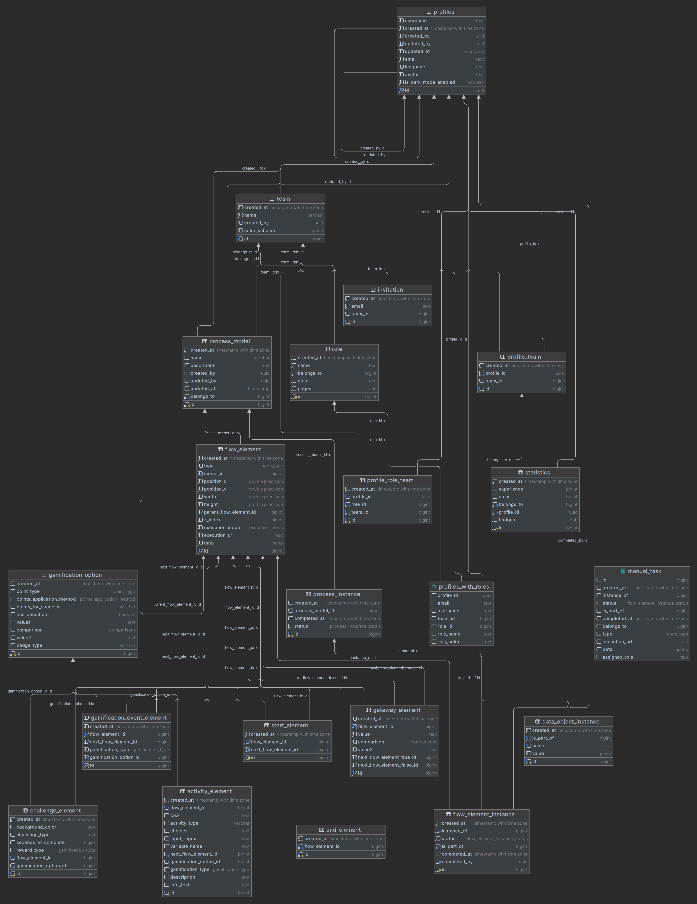

# `PROCESS-FLOW`

#### Build and manage gamificated business processes with ease.

<p align="left">
	<!-- Shields.io badges disabled, using skill icons. --></p>
<p align="left">
		<em>Built with the tools and technologies:</em>
</p>
<p align="center">
	<a href="https://skillicons.dev">
		
	</a></p>

<br>

Special thanks to [Emilija](https://github.com/ganglem) for designing the app logo!

##### 🔗 Quick Links

- [📍 Overview](#-overview)
- [👾 Key Features](#-key-features)
- [💻 Pages](#-pages)
- [🚀 Installation](#-installation)
- [🤖 Usage](#-usage)
- [➿ App Process Flow (Engine)](#-app-process-flow-engine)
- [📂 Repository Structure](#-repository-structure)
- [📚 Database Structure](#-database-structure)

---

## 📍 Overview
Process Flow is a web application designed to create and manage gamified business processes. The platform allows teams to be formed, members invited, roles defined, and tasks assigned according to process workflows. The goal is to streamline task management and business processes through an intuitive user interface combined with gamification principles.

---

### 👾 Key Features:
- **Team Management**: Create teams, invite users, assign roles, and manage team members.


- **Role-based Access**: Configure which pages each role can access. Available pages include:
    - **Editor**: For process creation and customization.
    - **Tasks**: Displays the tasks assigned to the user.
    - **Monitoring**: A dashboard to track and monitor the progress of active processes.
    - **Team**: Manage team members and their roles.
    - **Statistics**: View user performance metrics.


- **Process Creation**: Design and define business processes including gamification elements.


- **Process Execution**: Run processes and track their progress. As processes advance, users are notified of their next tasks.


- **Task Assignment**: Automatically assign tasks to users' worklists based on their roles and the current state of the process instances.


- **Monitoring Dashboard**: A centralized dashboard provides real-time visibility into active processes, helping track progress, identify bottlenecks, and monitor performance.


- **User Statistics**: Every user has a profile that tracks their progress through experience points, levels, coins, and badges as part of the gamification.

---

### 💻 Pages

- **Editor**: The Editor allows users to create and configure business processes. Users can define process flows and tasks. It is the key component for designing processes.


- **Tasks**: This section displays a user's assigned tasks. Tasks are automatically assigned based on the roles of users and the current process instances stages. Users can see pending tasks and mark them as complete once finished.


- **Monitoring**: The Monitoring page provides an overview of all ongoing processes. It allows users to track process instances in real-time, monitor progress, and identify potential bottlenecks. It is ideal for managers overseeing multiple workflows.


- **Team**: This section is used for managing teams and roles. It allows the creation of teams, inviting users, and assigning them roles. Role permissions can also be set to restrict or grant access to various pages such as the Editor, Monitoring, and Statistics.


- **Statistics**: Every user has a profile that tracks their performance metrics, including experience points, level progress, coins, and badges. This page helps users understand their individual achievements within the gamified processes and motivates them through tangible rewards for completing tasks and progressing in workflows.

---

## 🚀 Installation

To run the application locally, follow these steps:

1. Clone the repository:
   ```bash
   git clone https://github.com/MertenD/process-flow.git
   cd process-flow
    ```

2. Install dependencies:
   ```bash
   npm install
    ```

3. Init supabase
    ```bash
    npx supabase init
     ```

    You should use the given values inside the `.env` file, which can be copied from the `.env.example` file.


4. Apply migrations

    ```bash
    npx supabase migration up
     ```

   You should apply the migrations to the database to create the necessary tables.


5. Start the development server:
   ```bash
   npm run dev
    ```

The application will be available at `http://localhost:3000`. You can also see the supabase dashboard at `http://localhost:44323`.

---

## 🤖 Usage

1. **Create a Team**: Set up your team and invite users via email.
2. **Invite Users**: Add team members by their email adress in the teams dashboard.
2. **Define Roles**: Assign roles to users, such as "Manager", "Developer", or custom roles relevant to your business processes. You can also define which pages (Editor, Tasks, Monitoring, Team, Statistics) each role can access.
3. **Design Processes**: Use the interface to create business processes, including gamification elements and assigning roles.
4. **Start Processes**: Create process instances to run models.
5. **Complete Tasks**: Tasks will automatically appear in users’ worklists based on the process instance’s current state and the user's assigned role and can completed right there in the app.
5. **Monitor Progress**: Use the dashboard to monitor active processes and track task completion and overall progress.
6. **Track Statistics**: Users can view their personal statistics, including experience points, levels, coins, and badges, as a way to measure their engagement and progress.

---

## ➿ App Process Flow (Engine)

This section describes the workflow of process instances.

### Involved Components

- **Web App:** The interface that the user uses to start processes and complete tasks.
- **Database:** Stores the status and progress of process instances, as well as the results of tasks. It also functions as an engine that executes process steps.
- **External Servers:** These servers provide tasks, render them, and return user input results to the web app.

### Workflow Description

1. **Creating a Process Instance**
    - The user starts a new process instance via the web app or an API.
    - The web app communicates with the database to create this instance and start the process.


2. **Creating the First Step in the Database**
    - The database creates the new process instance.
    - At the same time, the first element in the process flow (flow element) is created. If it's a task, the instance's status is set to `TODO`.


3. **Task is Displayed to the User**
    - The user sees all elements in the web app under "Tasks" that have the `TODO` status and are assigned to their role.
    - These tasks need to be completed by the user.


4. **Opening the Task and Communication with External Server**
    - The user opens a task in the web app.
    - A request is sent to an external server. The server receives all information about the task, an ID, and a `responseURL`.
    - The server renders the task (e.g., as a form) and displays it in an `iframe` within the web app.
    - Once the user completes the task and clicks "Finish," the server sends the results and the task ID to the web app's `responseURL`.


5. **Completing the Task in the Database**
    - The web app receives the results from the server via an API endpoint.
    - The web app invokes a function in the database to mark the task as completed and store the results.


6. **Database Triggers the Next Element**
    - A trigger in the database detects that the task is completed and creates the next flow element with the status `TODO`.
    - This can either be a new user task or an automated step.


7. **Automated Elements are Executed Immediately**
    - If the next element in the process is an automated step (e.g., a gateway or the end of the process), the database automatically executes this step and creates the next flow element.


8. **Concurrent Execution**
    - The database can manage and execute multiple instances of a process simultaneously, allowing for parallel tasks or steps.

---

## 📂 Repository Structure

```sh
└── process-flow/
    ├── Dockerfile
    ├── README.md
    ├── components.json
    ├── documentation
    │   ├── docs
    │   └── mkdocs.yml
    ├── messages
    │   ├── de.json
    │   └── en.json
    ├── middleware.ts
    ├── next.config.mjs
    ├── package-lock.json
    ├── package.json
    ├── postcss.config.js
    ├── public
    │   ├── next.svg
    │   └── vercel.svg
    ├── src
    │   ├── actions
    │   ├── app
    │   ├── components
    │   ├── i18n
    │   ├── lib
    │   ├── model
    │   ├── styles
    │   ├── types
    │   └── utils
    ├── supabase
    │   ├── .gitignore
    │   ├── config.toml
    │   ├── migrations
    │   └── seed.sql
    ├── tailwind.config.js
    ├── tailwind.config.ts
    └── tsconfig.json
```

---

## 📚 Database Structure

The database structure is managed by Supabase, a cloud database service. The database schema is defined in the `supabase` directory, which includes migration files and a seed file. The database structure consists of the following tables:


