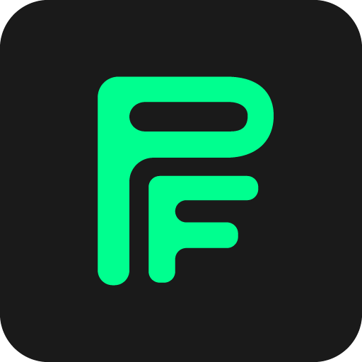
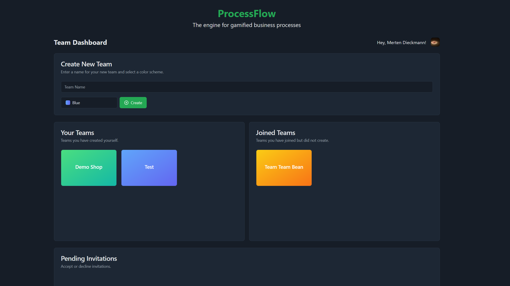
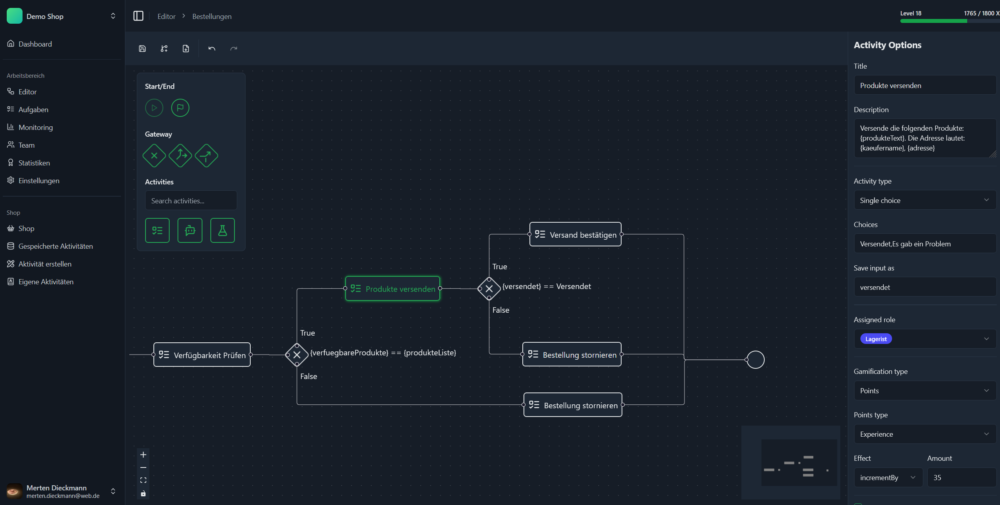
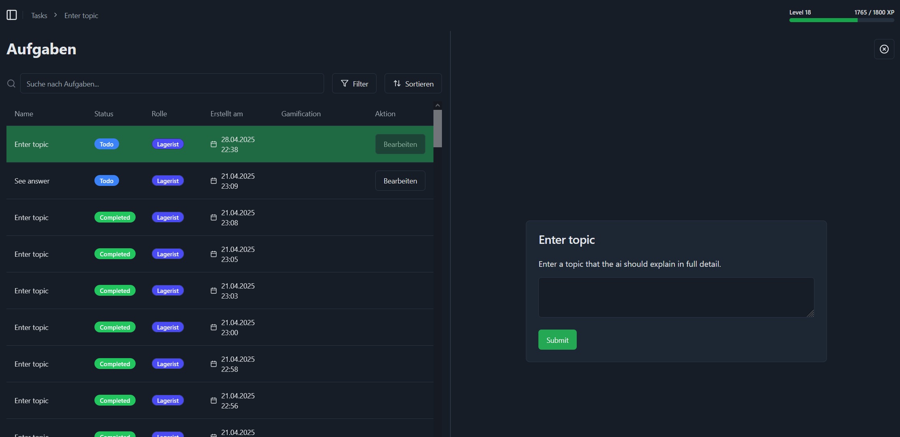
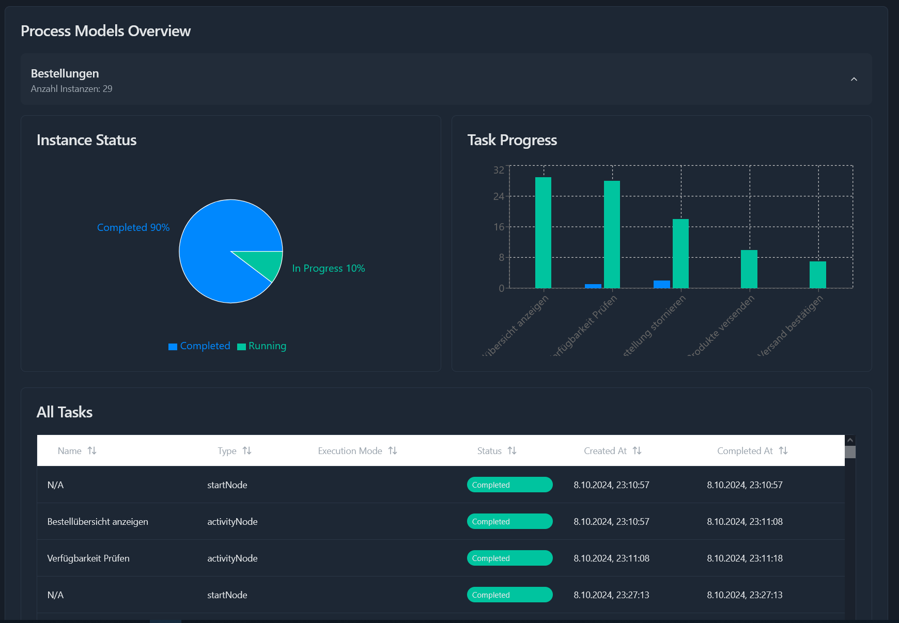
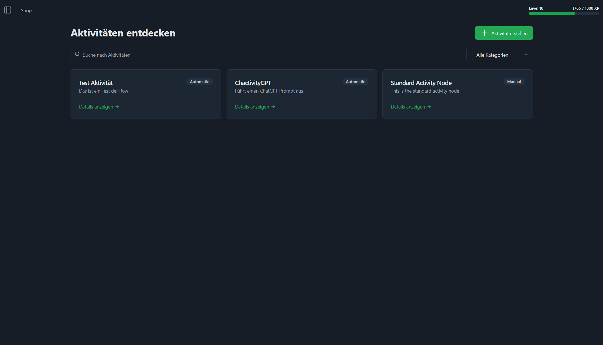
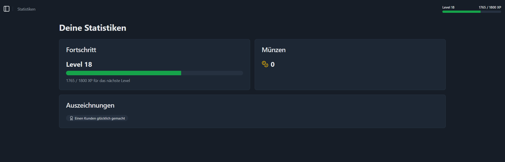
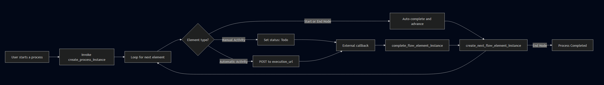
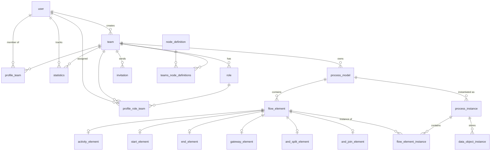

<div align="center">
  
  <h1>ProcessFlow</h1>
  <p>Build and execute gamified business processes with a visual editor, role-based task routing, and a database-driven process engine.</p>

  <a href="https://processflow.merten.tech"></a>
  <a href="https://github.com/MertenD/process-flow"></a>
</div>

---

## About

ProcessFlow lets teams model, deploy, and run structured workflows with full gamification built in. Process designs are created visually in a node-based editor — activities, gateways, parallel flows, and role assignments — and executed by a PostgreSQL-driven engine that advances instances automatically as tasks are completed.

Completing tasks earns XP, coins, and badges configured directly in the editor. A plugin architecture lets anyone extend the platform with custom activity types hosted on external servers, rendered inside iframes.

---

## Screenshots

<table>
  <tr>
    <td><strong>Team Dashboard</strong><br/></td>
    <td><strong>Workflow Editor</strong><br/></td>
  </tr>
  <tr>
    <td><strong>Task Worklist</strong><br/></td>
    <td><strong>Monitoring Dashboard</strong><br/></td>
  </tr>
  <tr>
    <td><strong>Activity Shop</strong><br/></td>
    <td><strong>User Statistics</strong><br/></td>
  </tr>
</table>

---

## Features

### Visual Workflow Editor
Design business processes with a drag-and-drop node graph. Connect activity nodes, exclusive gateways, and parallel AND-split/join nodes. Each node type is configurable via a side panel — including gamification rewards, role assignments, and output variables.

### Role-based Task Routing
Team members are assigned roles that control both page access and which process activities appear in their worklist. Tasks are automatically pushed to the right users as the process engine advances.

### Gamification
Every activity node can award XP, coins, or badges upon completion. Rewards are rule-based — conditions (comparisons against process variables), application methods (increment, decrement, set), and badge types are all configured in the editor.

### Process Engine
The engine runs inside PostgreSQL. Completing a task triggers a database function that stores output data, evaluates the next path (including gateway conditions and AND-join synchronisation), and creates the next flow element instance — all in one transaction. No dedicated backend process required.

### Automatic Activities
Activity nodes with `executionMode: Automatic` are dispatched via HTTP to an external server when created. The server processes the task and posts results back to `/api/instance/complete`. This enables fully automated steps within otherwise manual workflows.

### Activity Shop
Activity nodes are not hardcoded — they are **node definitions** that describe a reusable task type: its name, icon, UI structure (what inputs to show the user), and how it executes.

- **Manual** nodes render a custom task form in an iframe, served by an external server. The user fills it in and submits; the result is posted back to the process engine.
- **Automatic** nodes trigger an HTTP call to an external server when reached. The server does its work and calls back when done — no user interaction needed.

The shop lists all available node definitions. Teams browse it, install the types they want, and those types appear in the node palette inside the editor. Anyone can publish their own node type to the shop.

### Monitoring
Real-time overview of all process instances — running, completed, or errored — with per-process charts and task breakdown stats.

---

## Tech Stack

<div align="center">
  <br/>
</div>

<br/>

**Also uses:** better-auth · ReactFlow · Zustand · Radix UI · Recharts · Fumadocs · next-intl · Zod

---

## Process Engine Architecture

Each completed task triggers a chain of PostgreSQL functions that advance the process automatically:



| Step | What happens |
|------|-------------|
| `complete_flow_element_instance()` | Stores output data in `data_object_instance`, marks instance as Completed |
| `create_next_flow_element_instance` trigger | Evaluates gateway conditions, resolves variable placeholders, creates next instance(s) |
| `execute_created_flow_element_instance` trigger | Sets Manual tasks to `Todo`; sets Automatic tasks to `In Progress` |
| App layer (`dispatchAutomaticActivities`) | Makes HTTP POST to external server for Automatic tasks |

Parallel branches (AND-split) and synchronisation (AND-join) are handled natively in the trigger functions.

---

## Getting Started

### Option A — npm (local development)

Requires Node 20+ and a running PostgreSQL instance.

```bash
# 1. Clone & install
git clone https://github.com/MertenD/process-flow.git
cd process-flow
npm install

# 2. Configure environment
cp .env.example .env
# Fill in DATABASE_URL, BETTER_AUTH_SECRET, APP_URL

# 3. Apply migrations (tables + engine functions)
npm run db:migrate

# 4. Start dev server
npm run dev
```

### Option B — Docker (local, no Traefik)

Starts the app and a PostgreSQL container. Migrations run automatically on first start.

```bash
# 1. Configure environment
cp .env.example .env
# Set DB_PASSWORD and BETTER_AUTH_SECRET

# 2. Start stack (builds the image automatically on first run)
docker compose -f docker-compose.local.yaml up -d
```

App available at `http://localhost:3000`.

```bash
# Stop
docker compose -f docker-compose.local.yaml down

# Reset database
docker compose -f docker-compose.local.yaml down -v
```

### Option C — Hetzner (with Traefik)

```bash
docker compose up -d
```

Requires an external `web` Docker network with Traefik and a `le-merten` TLS resolver configured on the host.

---

## Environment Variables

| Variable | Required | Description |
|----------|----------|-------------|
| `DATABASE_URL` | ✅ | PostgreSQL connection string |
| `BETTER_AUTH_SECRET` | ✅ | Random secret for session signing |
| `BETTER_AUTH_URL` | ✅ | App base URL (e.g. `http://localhost:3000`) |
| `NEXT_PUBLIC_APP_URL` | ✅ | Public app URL (used client-side) |
| `APP_URL` | ✅ | App URL used by the process engine for callbacks |
| `DB_PASSWORD` | Docker | PostgreSQL password for the Docker Compose DB service |

Copy `.env.example` to `.env` and fill in the values before running.

---

## Database Structure


```mermaid
erDiagram
    user ||--o{ team : "creates"
    user ||--o{ profile_team : "member of"
    user ||--o{ profile_role_team : "assigned"
    user ||--o{ statistics : "tracks"

    team ||--o{ role : "has"
    team ||--o{ process_model : "owns"
    team ||--o{ profile_team : ""
    team ||--o{ profile_role_team : ""
    team ||--o{ invitation : "sends"
    team ||--o{ statistics : ""

    role ||--o{ profile_role_team : ""

    process_model ||--o{ flow_element : "contains"
    process_model ||--o{ process_instance : "instantiated as"

    flow_element ||--o| activity_element : ""
    flow_element ||--o| start_element : ""
    flow_element ||--o| end_element : ""
    flow_element ||--o| gateway_element : ""
    flow_element ||--o| and_split_element : ""
    flow_element ||--o| and_join_element : ""
    flow_element ||--o{ flow_element_instance : "instance of"

    process_instance ||--o{ flow_element_instance : "contains"
    process_instance ||--o{ data_object_instance : "stores"

    node_definition ||--o{ teams_node_definitions : ""
    team ||--o{ teams_node_definitions : ""
```

---

Special thanks to [Emilija](https://github.com/ganglem) for designing the app logo!
